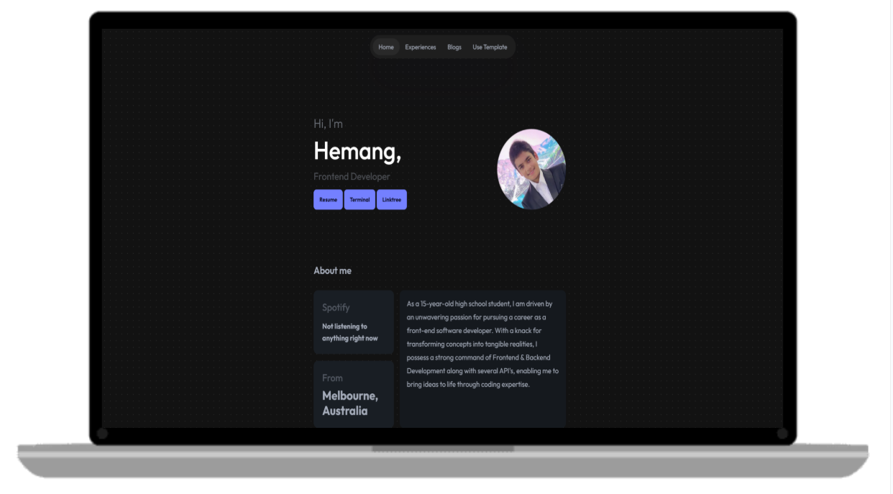
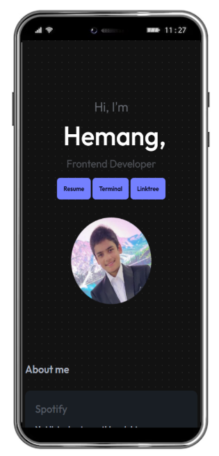
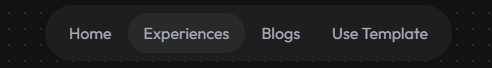
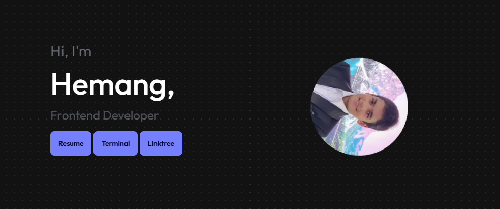
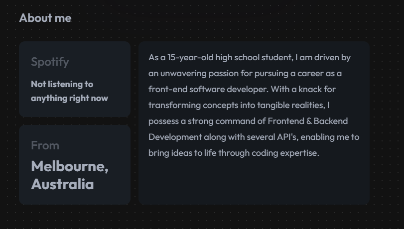
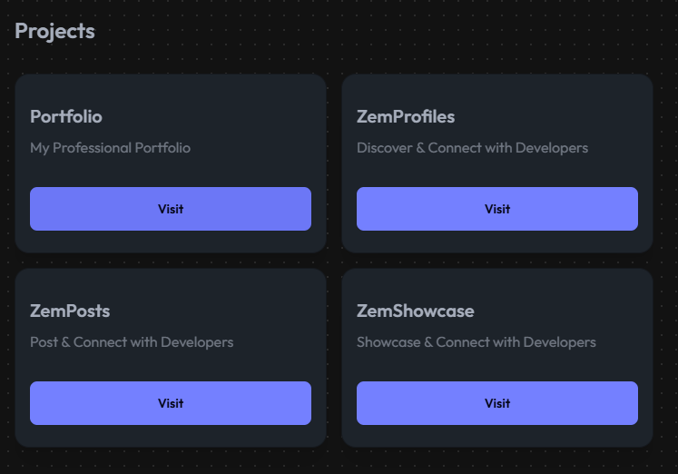
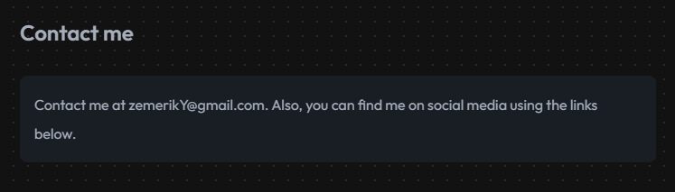
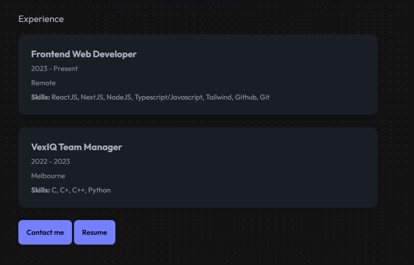
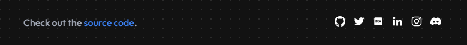

<p align = "center">


<br>

<br>


</p>

<h1 align = "center">
  Portfolio Template
</h1>

<p align = "center">
  
</p>


## ❗About:

Welcome to the Portfolio Template, your ultimate tool for crafting a professional and personalized portfolio that showcases your unique skills and achievements. This template is designed to empower users with a sleek, modern, and user-friendly interface, ensuring that your portfolio not only impresses but also effectively communicates your story and capabilities.

- Feel free to read my [Blog](https://zemerik.hashnode.dev/building-your-portfolio-in-2025) about this Project on Hashnode

<div align = "center">

[](https://www.youtube.com/watch?v=l-ePe_MJU-s)

</div>

## ⭐ Key Features:

- Customizable Sections

- Responsive Design

- Social Media Integration

- SEO Optimization

- Easy Setup

- Personal Branding



## 🤝 How to Install?

### Prerequisites:

- [NodeJS](https://nodejs.org) installed on your machine
- [GIT](https://git-scm.com) installed on your machine
- A Code Editor

### Cloning:

- To make a local copy of this Project on your machine, enter the following `GIT` Commmand in your Terminal:

```bash
git clone https://github.com/Zemerik/Portfolio-Template.git && cd Portfolio-Template
```

### Customising:

- This Portfolio can be easily customised to your choice, just follow the guide below:

<details>

<summary>
  Main Sections
</summary>

<br>

|                     Image                 |      Section    |                                 File                        |       Lines     |
| ----------------------------------------- | --------------  | ----------------------------------------------------------- | --------------  |
|                | Navbar          | `src/routes/Head.svelte`                                    | **30 - 47**     |
|                | Home            | `src/routes/+page.svelte`                                   | **27-52**       |
|            | About Me        | `src/routes/+page.svelte`                                   | **54 - 99**     |
|           | Projects        | `src/routes/Work.svelte`                                    | **3 - 28**      |
|        | Contact Me      | `src/routes/+page.svelte`                                   | **107 - 114**   |
|     | Experiences     | `src/routes/Experience.svelte`                              | **27-52**       |
|               | Footer          | `src/routes/Footer.svelte`                                  | **52 - 75**     |
|                     | SEO             | `src/routes/+page.svelte` & `src/routes/hire/+page.svelte`  | **25** & **6**  |

</details>

<details>

<summary>
  Spotify Status
</summary>

<br>

1. Join the [Lanyard](https://github.com/Phineas/lanyard) Discord Server, 
      - https://discord.com/invite/UrXF2cfJ7F
2. Head over to `src/routes/spotify.ts` and locate line **62**. 
3. Remove *1018816958587748383* and paste **YOUR DISCORD ACCOUNT ID** after `/users/`.

> Thanks to [Lanyard](https://lanyard.eggsy.xyz/) for making this possiblle!

</details>

### Quick Start:

- We can locally run this Project on our Network and see the output using the following Commands of `NodeJS` and `PNPM`:

> Install required Dependencies

```bash
npm i pnpm --force
```

```bash
pnpm i
```

> Run the output locally on your Network

```bash
pnpm run dev
```

### Hosting:

- After you have made your changes, you can host your Portfolio on [Vercel](https://vercel.com) or on [Netlify](https://www.netlify.com)

## 😎 Happy Coding!!

## 💁 Support:

For any kind of support or inforrmation, you are free to join our **Discord Server**,

<a href = "https://discord.gg/UF9KsmuGbr">
  
</a>

#

<p align = "center">
  Don't forget to leave a ⭐
  <br>
  Made with 💖 by <a href = "https://github.com/Zemerik">Hemang Yadav (Zemerik)</a>
</p>
